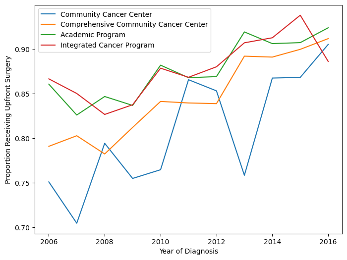
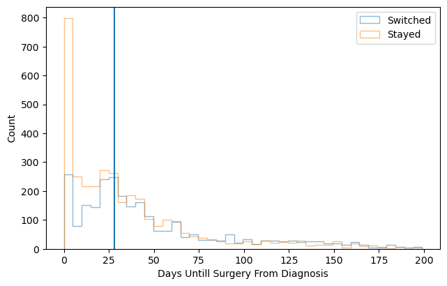

```{=html}
<style type="text/css">

code.r{
  font-size: 14px;
}
td {
  font-size: 12px;
}
code.python{
  font-size: 14px;
}
pre {
  font-size: 12px;
}

}

</style>
```

## How it all Started

This was my first project at my first real job. I had just come out of a chemistry degree — four years of thinking about organic synthesis — and practically overnight I had to start replacing all of that with oncology terminology. Neoadjuvant, adjuvant, NCCN guidelines, sphincter preservation, pathologic complete response. Different kind of molecules.

My PI, Dr. Nina Sanford, already had a solid hypothesis: a meaningful fraction of stage II-III rectal cancer patients were skipping the recommended neoadjuvant therapy and going straight to surgery, and this rate probably varied by facility type. The project moved faster than I'd expected — about two months from start to finish — because the NCDB data was relatively clean to begin with and the scientific question was already well-formed.

The standard of care for stage II-III rectal cancer is **neoadjuvant therapy** — chemotherapy and/or radiation *before* surgery — which improves outcomes by shrinking the tumor and reducing recurrence risk. Not everyone gets it. Some patients go straight to surgery ("upfront surgery"), and we wanted to understand who, why, and whether the trend was improving over time.

Figuring out what all the column codes actually meant was the real hurdle early on. The NCDB is not self-documenting — there's a lot of time spent in the data dictionary, mapping numeric codes to clinical concepts before you can write a single line of analysis. Once I had the codebook figured out, actual data cleaning was maybe a week.

Looking at this cleaning code now, I can already see things I'd do differently. There's a *lot* of filtering and row-dropping — unknown treatment codes filtered out, ambiguous sequences excluded, complete case analysis at the end — without much consideration of whether missingness was random or whether the resulting sample was still representative. Heavy filtering can introduce selection bias that's genuinely hard to detect after the fact, and I don't think I was fully appreciating that at the time.

## Project Setup

When I first wrote this code (many years ago) I was very much an R guy. I wanted to learn python, so I decided to try running python from R Studio. The idea is that these code chunks would actually execute when the blog rendered to show the output. This would come back to bite me today, more on that later.

```{r, warning=FALSE, message=FALSE, eval=FALSE}
library(dplyr)
library(ggplot2)
library(readr)
library(stringr)
library(tidyr)
library(haven)
library(lmtest)
library(glmnet)
library(nnet)
library(reticulate)
library(broom)
library(rmarkdown)
library(knitr)

use_virtualenv(file.path(here::here(), ".venv"), required = TRUE)
knitr::opts_chunk$set(python.reticulate = FALSE)
```

## Creating Synthetic Data

The original paper uses data from the National Cancer Database. This data is not public, so I created a synthetic dataset that attempts to recreate the characteristics of the original data but with much greater anonymization.

I'll be honest: I ran this synthesis script a while ago and I don't fully remember every choice I made. I know I stratified by race/ethnicity and median income — and in retrospect that makes sense, since minority subgroups can get smoothed out in synthetic data without explicit stratification — but I apparently didn't write down why I made those specific choices at the time. That's the kind of thing that seems obvious in the moment and mysterious 4 years later. Lesson learned about documenting your decisions while you're making them.

The approach uses the R package `synthpop`, which generates synthetic records using **classification and regression trees (CART)** with bootstrapping. CART models are fit sequentially to each variable, conditional on the previously synthesized variables. Bootstrapping (the `proper = TRUE` flag) adds an extra layer of uncertainty by resampling the original data before fitting each tree, which helps prevent overfitting to specific individuals. The quality of the synthetic data was apparently evaluated by comparing two-way contingency tables between real and synthetic data via pMSE. However, I have since lost these tables, and in fact lost the synthetic data tsv! So I can't really comment on the quality of the synthetic data...

### Clean and Prep Original Data

The first step was to clean and engineer variables as in the original paper (this was done back when I still had access to the original data).

```{r, eval=FALSE, tidy=TRUE}
# We will use synthpop to generate a synthetic data set
library(synthpop)

# Reading in original data from the NCDB
RectalData <- read_dta("ncdb_project_data.dta")

df1 <- RectalData %>% select(RX_SUMM_SYSTEMIC_SUR_SEQ,
                                 RX_SUMM_RADIATION,
                                 RX_SUMM_SURGRAD_SEQ,
                                 RX_SUMM_CHEMO,
                                 SEX,
                                 MED_INC_QUAR_12,
                                 AGE,
                                 raceb,
                                 TNM_CLIN_STAGE_GROUP,
                                 TNM_PATH_STAGE_GROUP,
                                 SEQUENCE_NUMBER,
                                 HISTOLOGY,
                                 RX_SUMM_SURG_PRIM_SITE,
                                 YEAR_OF_DIAGNOSIS,
                                 FACILITY_TYPE_CD,
                                 INSURANCE_STATUS,
                                 CDCC_TOTAL_BEST,
                                 DX_DEFSURG_STARTED_DAYS,
                                 CLASS_OF_CASE
)

# Remove unknown sequences, treatments, and keep proper hist codes & primary surgery
df1 <- df1 %>% filter(!RX_SUMM_SYSTEMIC_SUR_SEQ %in% c(6,7,9),
                      !RX_SUMM_RADIATION == 9,
                      !RX_SUMM_SURGRAD_SEQ %in% c(6, 9),
                      !RX_SUMM_CHEMO %in% c(99,88),
                      SEQUENCE_NUMBER %in% c("00","01"),
                      HISTOLOGY %in% c(8140, 8210, 8260, 8261, 8262, 8263, 8470, 8480, 8481),
                      RX_SUMM_SURG_PRIM_SITE %in% c(30, 40, 50, 60, 70, 80))

# Make a simple stage variable and filter to only stage 2 and 3
df1 <- df1 %>% mutate(TNM_CLIN_STAGE_GROUP, stage3 = ifelse(str_detect(TNM_CLIN_STAGE_GROUP,"2"),"2","0"))
df1$stage3[str_detect(df1$TNM_CLIN_STAGE_GROUP,"3") == TRUE] <- "3"
df1 <- df1[!(df1$stage3 =="0"),]

# Define neoadjuvant, rad or chemo before surgery
df1 <- df1 %>% mutate(neoadjuvant = 3)
df1 <- df1 %>% mutate(neoadjuvant = case_when(RX_SUMM_SURGRAD_SEQ %in% c(2,4) ~ 1,
                                              RX_SUMM_SYSTEMIC_SUR_SEQ %in% c(2,4) ~ 1,
                                              RX_SUMM_RADIATION==0 & RX_SUMM_CHEMO %in% c(0, 82, 85, 86, 87) ~ 0,
                                              RX_SUMM_SURGRAD_SEQ==3 & RX_SUMM_CHEMO %in% c(0, 82, 85, 86, 87) ~ 0,
                                              RX_SUMM_SYSTEMIC_SUR_SEQ==3 & df1$RX_SUMM_RADIATION==0 ~ 0,
                                              RX_SUMM_SURGRAD_SEQ==3 & RX_SUMM_SYSTEMIC_SUR_SEQ==3 ~ 0
                                              )) %>% filter(neoadjuvant != 3)

# age group under 45, 45-65, 65 and up AGE
df1 <- df1 %>% mutate(agegroup= case_when(AGE<=45 ~0, AGE >45 & AGE <65 ~1, AGE >= 65 ~2))

# create a var for switching facility and add the unknown gov insurance to unknown insurance
df1 <- df1 %>% mutate(CLASS_OF_CASE, treatnotatdiag = ifelse(CLASS_OF_CASE %in% c(0,20,21,22),"Switched","Stayed"),
                      INSURANCE_STATUS = ifelse(INSURANCE_STATUS==4,9,INSURANCE_STATUS))

# Omit NA, this project used complete case analysis
df1 <- na.omit(df1)

# Keep only relevant variables
df1 <- df1 %>% select(SEX,
                      MED_INC_QUAR_12,
                      agegroup,
                      raceb,
                      stage3,
                      neoadjuvant,
                      treatnotatdiag,
                      YEAR_OF_DIAGNOSIS,
                      FACILITY_TYPE_CD,
                      INSURANCE_STATUS,
                      CDCC_TOTAL_BEST,
                      DX_DEFSURG_STARTED_DAYS
)

# Make variables into factors
df2 <- mutate(across(!DX_DEFSURG_STARTED_DAYS, as.factor))
```

### Generate Synthetic Data

I now used the package `synthpop` to create a synthetic data set using bootstrapping and classification and regression trees. As an additional final step, I removed all rows that happen to be identical to rows in the original data to ensure every row is synthetic.

```{r, eval=FALSE, tidy=TRUE}
# Make synthetic data using CART and bootstrapping

# Reorder for synthetic data generation
df3 <- df2 %>% dplyr::relocate(raceb,MED_INC_QUAR_12, neoadjuvant)

# Strat by race and ethnicity and median income for best overlap
synth_1 <- syn.strata(df3, proper = TRUE, strata = df2$raceb)
synth_2 <- syn.strata(df3, proper = TRUE, strata = df3$MED_INC_QUAR_12)

synth_dat1 <- synth_1$syn
synth_dat2 <- synth_2$syn

vars_i_want <- colnames(df2)
vars_i_want<-vars_i_want[!vars_i_want == "DX_DEFSURG_STARTED_DAYS"]

# Check Heat maps to compare pMSE
synthpop::utility.tables(synth_dat1, df3,tables="twoway",vars = vars_i_want)
synthpop::utility.tables(synth_dat2, df3,tables="twoway",vars = vars_i_want)

# Remove Replicates & tag for synthetic
final_synth_data <- sdc(synth_2, df3, label="synthetic", rm.replicated.uniques = TRUE)
f <- final_synth_data$syn
write_tsv(f, "synthetic_NCDB_data.tsv")
```

## Analysis Using Synthetic Data

### Logistic Regression

Looking at this section is where the cringing starts. The approach — throw every covariate into a single logistic regression and interpret the coefficients — is a classic early-career move that I'd handle differently now.

The core problem is **non-collapsibility of the odds ratio**. When you adjust for many covariates in a logistic model, the coefficient for a given predictor isn't a clean marginal effect — it's a conditional association that shifts as you add more variables, even when those variables aren't confounders. That's a mathematical property of odds ratios in nonlinear models, not evidence of confounding being controlled. With as many adjustment terms as this model has, it's genuinely hard to say what any individual OR is actually telling you about the population-level effect.

What I'd do today: fit the same outcome model, but then use it to compute a **marginal estimand** via standardization (sometimes called g-computation). After fitting the model, create two copies of the dataset — one where everyone's exposure is set to 1, one where it's set to 0 — use the model to predict outcome probabilities for every individual under each scenario, then average those predictions across the sample. The difference between those averages is a risk difference: a number that actually means something. "Being treated at a community cancer program was associated with a 12 percentage point lower probability of receiving neoadjuvant therapy" is interpretable in a way that a conditional OR from a 10-variable logistic model isn't.

That said, doing the side-by-side in R and Python was a useful exercise for myself at the time. R's `glm` formula interface is more natural for this kind of work — write the formula, factor encoding is handled automatically. Python's `statsmodels` requires wrapping each categorical with `C()`, which is more verbose but more explicit. For a first exploratory pass, I still tend to reach for R.

The odds being calculated here are for receipt of neoadjuvant therapy, so the ORs are reversed in comparison to the original paper.

As alluded to earlier, the idea back in the day was to execute these chunks when the blog renders. As I have since lost the original synthetic data, I had to have Claude figure out how to grab the frozen html.json from the commit history and inject the old code chunk execution outputs into the new blog post. I'm not sure how Claude actually did that...

::: panel-tabset
#### Using R

```{r, tidy=TRUE, message=FALSE, eval=FALSE}
# Load synthetic data
synthetic_NCDB_data <- read_delim("synthetic_NCDB_data.tsv", delim = "\t", escape_double = FALSE, trim_ws = TRUE)
synthetic_NCDB_data <- synthetic_NCDB_data %>% mutate(across(!DX_DEFSURG_STARTED_DAYS, as.factor))

#logistic regression
log_fit <- glm(neoadjuvant ~ YEAR_OF_DIAGNOSIS +
      MED_INC_QUAR_12 +
      INSURANCE_STATUS +
      raceb +
      CDCC_TOTAL_BEST +
      SEX +
      agegroup +
      stage3 +
      FACILITY_TYPE_CD +
      treatnotatdiag,
    data = synthetic_NCDB_data, family = binomial(link = logit))

# Tidy results
tidy_log_fit <- data.frame(summary(log_fit)$coefficients)
rmarkdown::paged_table(round(tidy_log_fit %>% mutate(OR = exp(Estimate)) %>% arrange(`Pr...z..`),3))
```

#### Using Python

```{python, eval=FALSE}
import numpy as np
import pandas as pd
import matplotlib.pyplot as plt
import statsmodels.formula.api as smf

synthetic_NCDB_data_py = pd.read_csv("synthetic_NCDB_data.tsv", sep = '\t')

# Logistic Regression for odds of upfront surgery
model = smf.logit(formula="neoadjuvant~ C(YEAR_OF_DIAGNOSIS) + C(stage3) + C(MED_INC_QUAR_12) + C(INSURANCE_STATUS) + C(raceb) + C(CDCC_TOTAL_BEST) + C(SEX) + C(agegroup) + C(FACILITY_TYPE_CD) + C(treatnotatdiag)",data = synthetic_NCDB_data_py).fit()

mod_summary = model.summary()
mod_summary_table = pd.read_html(mod_summary.tables[1].as_html(), header=0, index_col=0)[0]
print(mod_summary_table)
```
:::

### Proportions Over Time

This figure shows the proportion of patients receiving neoadjuvant treatment by facility type and how it changed over time. In retrospect, using an interpolated line graph for annual proportions is a slightly odd choice — a step plot or grouped bar chart would probably communicate the year-to-year changes more honestly. But it gets the point across.

There were also some display issues getting the Python figure to render correctly, so I saved it before knitting. Apologies for the colors not matching between versions.

::: panel-tabset
#### Using R

```{r, tidy=TRUE, warning=FALSE, message=FALSE, fig.height=4, fig.width=8, eval=FALSE}
# Making df of just people who got upfront surg
synthetic_NCDB_data2 <- synthetic_NCDB_data %>% mutate(neoadjuvant = as.numeric(neoadjuvant)-1)
df2 <- synthetic_NCDB_data2 %>% filter(neoadjuvant == 0)

# renaming the fac type
dfyear <- synthetic_NCDB_data2 %>% dplyr::select(YEAR_OF_DIAGNOSIS, neoadjuvant, FACILITY_TYPE_CD)
dfyear$Facility_Type[dfyear$FACILITY_TYPE_CD == 1] <- "Community Cancer Program"
dfyear$Facility_Type[dfyear$FACILITY_TYPE_CD == 2] <- "Comprehensive CC Program"
dfyear$Facility_Type[dfyear$FACILITY_TYPE_CD == 3] <- "Academic Program"
dfyear$Facility_Type[dfyear$FACILITY_TYPE_CD == 4] <- "Integrated Network Cancer Program"

# finding proportion of upfront surg by fac type
dfyear <- dfyear %>% dplyr::group_by(YEAR_OF_DIAGNOSIS, Facility_Type) %>% dplyr::summarize(ratio=mean(neoadjuvant))

# finding overall median per year of upfront surg
dfyearavg <- synthetic_NCDB_data2 %>% dplyr::group_by(YEAR_OF_DIAGNOSIS) %>% dplyr::summarize(ratio = mean(neoadjuvant))
dfyearavg$Facility_Type <- "Overall Median"
dfyearavg <- dfyearavg %>% select(YEAR_OF_DIAGNOSIS, Facility_Type, ratio)

# Merging overall and by facility type
year1 <- as.data.frame(dfyear)
year2 <- as.data.frame(dfyearavg)
mergedyearly <- rbind(year1,year2)
mergedyearly$Facility_Type <- factor(mergedyearly$Facility_Type, levels = c("Integrated Network Cancer Program",
                                                                            "Academic Program",
                                                                            "Overall Median",
                                                                            "Comprehensive CC Program",
                                                                            "Community Cancer Program"))

#plotting upfron surg by fac type
ggplot(mergedyearly) +
  geom_line(data = mergedyearly, aes(x=YEAR_OF_DIAGNOSIS, y=ratio, group = Facility_Type, color=Facility_Type), size = 1.3) +
  labs(x="Year of Diagnosis", y = "Proportion Receiving Upfront Surgery", color = "Facility Type") +
  theme_test() + scale_color_brewer(palette = "Dark2")
```

#### Using Python

```{python, eval = FALSE, tidy = TRUE }
# Graphing proportion receiving upfront surg at different facility types over time
rcParams['figure.figsize'] = 8,6

dfCC = synthetic_NCDB_data_py.query('FACILITY_TYPE_CD==1').filter(['YEAR_OF_DIAGNOSIS','neoadjuvant']).groupby(['YEAR_OF_DIAGNOSIS']).agg(['mean'])
dfCCC = synthetic_NCDB_data_py.query('FACILITY_TYPE_CD==2').filter(['YEAR_OF_DIAGNOSIS','neoadjuvant']).groupby(['YEAR_OF_DIAGNOSIS']).agg(['mean'])
dfA = synthetic_NCDB_data_py.query('FACILITY_TYPE_CD==3').filter(['YEAR_OF_DIAGNOSIS','neoadjuvant']).groupby(['YEAR_OF_DIAGNOSIS']).agg(['mean'])
dfIN = synthetic_NCDB_data_py.query('FACILITY_TYPE_CD==4').filter(['YEAR_OF_DIAGNOSIS','neoadjuvant']).groupby(['YEAR_OF_DIAGNOSIS']).agg(['mean'])

plt.figure(figsize = (8,6))

plt.plot(dfCC, label="Community Cancer Center")
plt.plot(dfCCC, label="Comprehensive Community Cancer Center")
plt.plot(dfA, label="Academic Program")
plt.plot(dfIN, label="Integrated Cancer Program")
plt.legend()
plt.xlabel("Year of Diagnosis")
plt.ylabel("Proportion Receiving Upfront Surgery")
plt.savefig('posts/first_project/overtime.png',bbox_inches='tight')
```


:::

### Delays in Surgery and Facility Switching

This final figure displays the counts of upfront surgery patients by how many days they waited until surgery, colored by whether they switched facilities or not.

::: panel-tabset
#### Using R

```{r, warning=FALSE, tidy=TRUE, message=FALSE, fig.height=4, fig.width=8, eval=FALSE}
#making three groups for a surgery delay
df2$surggroup[df2$DX_DEFSURG_STARTED_DAYS == 0] <- "Day zero"
df2$surggroup[df2$DX_DEFSURG_STARTED_DAYS > 0 & df2$DX_DEFSURG_STARTED_DAYS < 28] <- "Short delay"
df2$surggroup[df2$DX_DEFSURG_STARTED_DAYS >= 28] <- "Long Delay"
df2$surggroup <- factor(df2$surggroup)

#plotting surg delay and switching facility
ggplot(df2, aes(x=DX_DEFSURG_STARTED_DAYS,fill=treatnotatdiag)) +
  geom_histogram(binwidth = 5) +
  xlim(-10,200) +
  labs(x="Days Until Surgery From Diagnosis", y = "Count", fill = "Facility Switch") +
  theme_test() + scale_fill_brewer(palette = "Set2") +
  geom_vline(xintercept=28)
```

#### Using Python

```{python, eval=FALSE, tidy = TRUE}
#Data frame that only includes people who got upfront surg
dfsurg = synthetic_NCDB_data_py.query('neoadjuvant == 0')

# Plotting surgery delay and switching facility
dfsurggraph = dfsurg.filter(['treatnotatdiag','DX_DEFSURG_STARTED_DAYS']).query('DX_DEFSURG_STARTED_DAYS<200')
dfsurggraphswitch = dfsurggraph.query('treatnotatdiag == "Switched"')
dfsurggraphstay = dfsurggraph.query('treatnotatdiag == "Stayed"')
plt.clf()
plt.hist(dfsurggraphswitch['DX_DEFSURG_STARTED_DAYS'], bins=40, fill=False,histtype='step',stacked=True,label="Switched",alpha=0.5)
plt.hist(dfsurggraphstay['DX_DEFSURG_STARTED_DAYS'], bins=40,fill=False,histtype='step',stacked=True,label="Stayed",alpha=0.5)
plt.xlabel("Days Until Surgery From Diagnosis")
plt.ylabel("Count")
plt.legend()
plt.axvline(x=28)
plt.savefig('posts/first_project/switchvstay.png',bbox_inches='tight')
plt.show()
```


:::

## Reflections

Looking back at this project now, the thing that strikes me most is how little I actually knew at the time. I had just started my first job, I knew how to open a Jupyter notebook, and I was writing my first academic paper. That's a fun combination.

My PI, Dr. Sanford, was patient with the first draft. Patient might be an understatement — she did a lot of edits. Seeing how a raw first attempt at clinical methods writing gets shaped into something publishable is a hard lesson to learn any other way, and I definitely needed it.

More than anything, though, this project is a big reason I got motivated to go get my master's degree. Working through a logistic regression without fully understanding what the coefficients meant, or what the model was actually assuming about the data — that discomfort was productive. I knew I was using tools I didn't fully understand, and I wanted actual mastery of the fundamentals, not just the ability to run the function. About a year later I found myself applying to programs, and this project is a big part of why.

It also got me seriously started learning Python, which turned out to matter a lot for where my career went from here.

## Citation

**Hein D**, Ahn C, Aguilera T, Folkert M, Sanford NN. Trends and Factors Associated with Receipt of Upfront Surgery for Stage II-III Rectal Adenocarcinoma in the United States. *Journal of Gastrointestinal Cancer*. 2022. <https://pubmed.ncbi.nlm.nih.gov/33710137/>