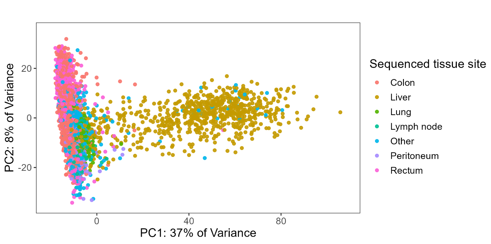
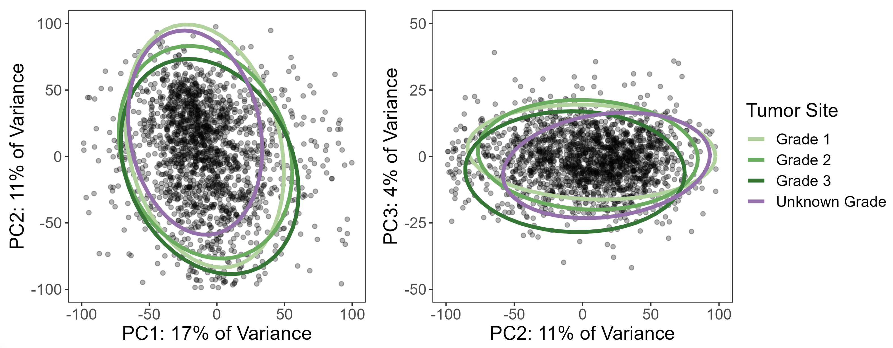
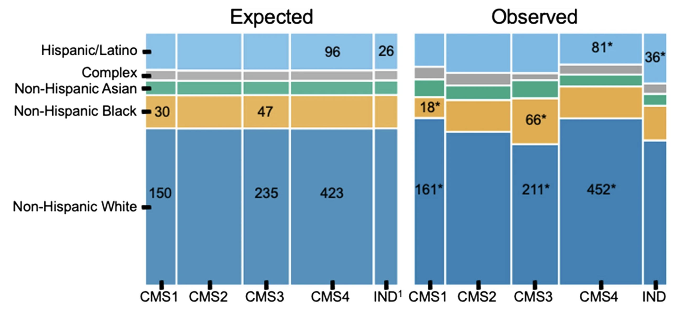

```{=html}
<style type="text/css">

code.r{
  font-size: 14px;
}
td {
  font-size: 12px;
}
pre {
  font-size: 12px;
}

</style>
```

## A Bigger Follow-Up

This project grew directly out of an earlier paper — [Hein et al., *JNCI* 2022](https://academic.oup.com/jnci/article-abstract/114/6/866/6548287) — which examined racial and ethnic differences in genomic profiling of early-onset colorectal cancer using Tempus sequencing data combined with the AACR Project GENIE dataset. That paper found that driver mutation profiles differed across racial and ethnic groups and that early-onset CRC had a distinct molecular signature. It was personally my first paper in a higher-impact journal, and it raised an obvious question: what does this look like at the transcriptomic level, and what happens if you do it with a much larger cohort?

The Tempus team wanted to find out. The result was this paper: all Tempus data, RNA-seq added on top of the mutation analysis, and a more thorough look at both genetic ancestry and age of onset. The scientific question is whether CRC tumors differ molecularly by ancestry — not just in which mutations are present, but in gene expression patterns, pathway activity, and whether the consensus molecular subtypes used to classify CRC are distributed the same way across ancestry groups.

This work was published in [*Genome Medicine*](https://doi.org/10.1186/s13073-024-01373-w) (2024) as a collaboration between UTSW and Tempus AI. I was co-first author with Brooke Rhead — she handled the genetic ancestry estimation and DNA-based driver mutation analysis, while I led the RNA-seq and pathway analyses. I learned a lot about statistics and bioinformatics from working with her, and we worked well together throughout the project.

What made this analysis possible was the scale of the Tempus dataset: **8,454 CRC patients** sequenced with the xT 648-gene panel, of which **2,745 had whole-exome RNA-seq** with genetic ancestry proportions estimated from 654 ancestry-informative markers. Having that many patients made it feasible to run multiple independent analytical approaches and require agreement across methods before claiming a finding — which turned out to be the methodological backbone of the whole paper.

## Data Exploration & Batch Correction

The first analysis step was understanding the structure of the RNA-seq data. Samples were sequenced on different Tempus assay versions — a classic batch effect in any multi-year clinical dataset.

We used DESeq2's **variance-stabilizing transform (VST)** for normalization, then **limma's `removeBatchEffect`** to correct for assay version:

``` r
# VST normalization
dds <- DESeqDataSetFromMatrix(countData = count_mat2,
                              colData = clinical_ordered,
                              design = ~ assay_name_rna)
keep <- rowSums(counts(dds) >= 10) >= round(0.05 * nrow(clinical_ordered))
dds <- dds[keep,]
vsd <- vst(dds, blind = TRUE)

# PCA before batch correction — shows strong assay effect
plotPCA(vsd, intgroup = c("assay_name_rna"))

# Remove batch effects
counts_batch_removed <- removeBatchEffect(assay(vsd), batch = clinical_ordered$assay_name_rna)
assay(vsd) <- counts_batch_removed

# PCA after — batch effect gone, now biological signal dominates
plotPCA(vsd, intgroup = c("assay_name_rna"))
plotPCA(vsd, intgroup = c("new_site"))
```

The post-correction PCA revealed that **tissue site was the dominant source of expression variation** (PC1 explained 37% of variance). Colon/rectum samples clustered separately from liver metastases, which motivated splitting the cohort into site-specific analyses rather than pooling everything together.



## Variable Selection via PCA

Beyond batch correction, PCA turned out to be one of the most useful diagnostic tools in the analysis — specifically for understanding whether missing data was random or systematic.

Take tumor grade: 21% of colon/rectum patients were missing it. The standard temptation is to either drop those patients or run a complete case analysis. But before doing that, I used PCA to ask whether patients with missing grade *looked different* in expression space. If they scattered randomly, missing-at-random might be a defensible assumption. If they clustered together, that would be a signal that grade was *missing not at random* (MNAR) — meaning patients with unknown grade had systematically different tumors, and dropping them would introduce bias.

The PCA was unambiguous: patients with missing grade clustered tightly together. So instead of dropping them, we used a **missing indicator approach** — treating "grade unknown" as its own category in the model — which preserved the full sample while avoiding the bias of silently excluding a subgroup with a distinct expression profile.

``` r
# PCA with multiple clinical variables
site   <- plot_pca(clinical_pca, "new_site")
grade  <- plot_pca(clinical_pca, "grade")
stage  <- plot_pca(clinical_pca, "stage2")
msi    <- plot_pca(clinical_pca, "msi_status")
rnav   <- plot_pca(clinical_pca, "assay_name_rna")
gender <- plot_pca(clinical_pca, "gender")

ggarrange(site, grade, stage, msi, rnav, gender, ncol = 2)
```



The same diagnostic process drove the other variable selection decisions: clinical stage was missing in 37% of patients (too large to handle, dropped entirely), and MSI-high tumors were excluded because they were too few to model reliably and showed clearly different expression patterns in PCA. All of these decisions came from looking at the data rather than applying a fixed rule.

## Limma-Voom Differential Expression

For differential expression testing, we used the **limma-voom** pipeline on TMM-normalized counts (separate from the VST used for exploration). All analyses were run twice — once with ancestry encoded as imputed race/ethnicity categories (discrete), and once with genetic ancestry proportions as a continuous variable — so results could be examined from both angles.

### Handling ancestry as a continuous variable: pivot coordinates

Ancestry proportions (e.g., 0.73 EUR, 0.22 AFR, 0.05 AMR, ...) are compositional data: they sum to 1, which means they aren't independent of each other and can't be dropped into a standard linear model without violating its assumptions. Including all five proportions directly would be collinear and uninterpretable.

The solution is an **isometric log-ratio (ILR) transformation**, specifically the "pivot coordinate" form using the `pivotCoord` function from the `robCompositions` R package. This transforms the five proportions into four orthogonal log-ratio coordinates that can be used in standard regression models. Crucially, the pivot coordinate representation is sequentially constructed so that each ancestry component of interest can be placed in the "pivot" position — meaning its coordinate reflects its association *adjusted for all remaining ancestries*. Each ancestry was tested in a separate model with its proportion in the pivot position, giving five total tests per analysis.

This approach was applied consistently across the differential expression models, gene set analyses, and the CMS multinomial regressions.

### Design matrices

The design matrices encoded genetic ancestry in two ways:

-   **Discrete**: Imputed race/ethnicity categories as indicator variables, NH White as reference, "complex" category excluded
-   **Continuous**: Five separate models, each with one ancestry proportion placed in the pivot coordinate position

``` r
# TMM normalization + voom transformation
voom_crc_discrete <- voom(counts_tmm_crc, design_crc_discrete, plot = TRUE, normalize = "none")
fit_crc_discrete  <- lmFit(voom_crc_discrete, design_crc_discrete)
fit_crc_discrete  <- eBayes(fit_crc_discrete)

summary(decideTests(fit_crc_discrete))
```

All models adjusted for age at onset, sex, tumor grade, stage, and MSI status. Consistency checks throughout the code — verifying coefficient sums match expected values — were built in so that any change in input data, filtering, or package versions would trigger an explicit error rather than silently producing different results.

## Gene Set Analysis: Two Workflows on Purpose

Rather than picking a single gene set testing method, I ran two independent workflows with different normalization strategies and different statistical hypotheses. The rationale was straightforward: RNA-seq pathway analysis has a lot of degrees of freedom, and requiring agreement between two methods that are testing genuinely different things is a much stronger check than running one and hoping it's right.

### mROAST (self-contained test)

ROAST asks whether genes in a pathway are collectively differentially expressed — it tests only within the gene set, without comparing to genes outside of it. This makes it more powerful for detecting subtle but consistent changes within a specific biological program. Computationally, it's intensive: 20,000 rotations per test, across 4 ancestry contrasts and \~250 gene sets, which required parallelization.

We used socket-based parallelization (not forking) with explicit seed-setting on each worker — a detail that matters a lot for reproducibility in permutation-based tests:

``` r
# Build gene set membership vectors
hallmarks <- msigdbr(species = "Homo sapiens", category = "H") %>%
  dplyr::select(gs_name, ensembl_gene)
c2 <- msigdbr(species = "Homo sapiens", category = "C2") %>%
  dplyr::select(gs_name, ensembl_gene)
c2_biocarta <- c2 %>% filter(str_detect(gs_name, "BIOCARTA.+"))

# For each gene set, create a logical vector: is each gene in the count matrix a member?
geneset_list_crc <- list()
for (i in 1:ncol(all_genesets_wide)) {
  geneset_list_crc[[all_genesets_names[i]]] <-
    row.names(counts_tmm_crc) %in% unlist(all_genesets_wide[1, i])
}

cluster <- makeCluster(4)
registerDoParallel(cluster)
clusterEvalQ(cluster, set.seed(2023))

crc_roast_parallel_discrete <- foreach(i = 2:5) %dopar% {
  limma::mroast(y = voom_crc_discrete,
                index = geneset_list_crc,
                design = design_crc_discrete,
                contrast = i, nrot = 20000)
}
stopCluster(cluster)
```

### GSVA (competitive test)

GSVA takes a different approach: it computes per-sample pathway enrichment scores and evaluates whether genes in a set are up or down *relative to genes outside of it*. It's better suited to identifying which specific pathways stand out from the background of the whole transcriptome.

``` r
# Compute pathway enrichment scores per sample
set_scores_crc <- gsva(counts_batch_crc, geneset_list_list)

# Fit limma models on the enrichment scores
fit_set_scores_crc_discrete <- lmFit(set_scores_crc, design_crc_discrete)
fit_set_scores_crc_discrete <- eBayes(fit_set_scores_crc_discrete)

summary(decideTests(fit_set_scores_crc_discrete))
```

### Requiring agreement across both

Both methods were tested on the Hallmark and BioCarta C2 gene sets (342 total), run separately on colon/rectum and liver subsets, and with both discrete and continuous ancestry representations. A finding was only reported if it was significant (BH-corrected p \< 0.05) in **both** mROAST and GSVA. This is conservative, but it substantially reduces the chance of chasing a result that was an artifact of one method's assumptions.

**Key finding**: Non-Hispanic Black ancestry and higher AFR proportion were consistently associated with underexpression of coagulation and complement pathways in colon/rectum tumors — replicated across both independent workflows.

## Consensus Molecular Subtype (CMS) Analysis

CMS classification groups CRC tumors into four biologically distinct subtypes based on gene expression. We used the `CMScaller` package on the batch-corrected expression data:

``` r
cms_res_crc <- CMScaller(counts_batch_crc, rowNames = "ensg", FDR = 0.05)

clinical_crc_cms <- cbind(clinical_files$crc, cms_res_crc) %>%
  mutate(prediction = ifelse(is.na(prediction), "unknown", prediction)) %>%
  mutate(genetic_ancestry_group = as.factor(genetic_ancestry_group))

clinical_crc_cms <- within(clinical_crc_cms,
  genetic_ancestry_group <- relevel(genetic_ancestry_group, ref = "european"))
```

To test whether CMS distributions differed by ancestry, we used multinomial logistic regression and chi-squared tests with post-hoc inspection of standardized residuals:

``` r
# Discrete ancestry model
multinom_cms_discrete_age <- multinom(prediction ~ genetic_ancestry_group + early_onset,
                                      data = clinical_crc_cms)
multinom_cms_discrete_results <- tidy(multinom_cms_discrete_age, conf.int = TRUE)

# Continuous ancestry (one model per ancestry component)
multinom_cms_cont_res <- list()
for (i in 1:5) {
  temp_data <- as.data.frame(design_crc_cont[i])
  temp_data <- cbind(clinical_crc_cms$prediction, temp_data[, 9:12])
  colnames(temp_data) <- c("predicted_cms",
    str_extract(colnames(temp_data)[2], "^[^\\.]+"), "adj1", "adj2", "adj3")

  multinom_temp <- multinom(predicted_cms ~ ., data = temp_data)
  multinom_cms_cont_res[[colnames(temp_data)[2]]] <-
    as.data.frame(tidy(multinom_temp, conf.int = TRUE))
}
```

**Key findings**: CMS was significantly associated with race and ethnicity (p = 0.004). NH Black patients had more CMS3 than expected (66 observed vs. 46 expected) and less CMS1 (18 vs. 30). Hispanic/Latino patients had elevated rates of indeterminate CMS — concentrated specifically in the early-onset group. When analyzed by continuous ancestry proportions, greater AFR ancestry was associated with higher odds of CMS3. All of the NH Black / CMS1 and CMS3 associations were only statistically significant in the average-onset group, while the Hispanic/Latino indeterminate finding was only present in early-onset. Both imputed race/ethnicity and continuous ancestry proportions were tested separately.



The elevated indeterminate classification rate in Hispanic/Latino patients is worth flagging: it raises the question of whether the CMS classifier itself performs less reliably in non-European-ancestry populations, since the framework was largely developed and validated in predominantly European cohorts.

## Key Takeaways

-   **PCA as a missing data diagnostic** — using dimensionality reduction to test whether missing covariates were MNAR vs. MCAR changed how we handled tumor grade and avoided a subtle but real source of bias
-   **Two workflows, one threshold** — requiring BH-corrected p \< 0.05 in both mROAST and GSVA before reporting a pathway finding added meaningful robustness to the results
-   **Tissue site dominates expression** — site-specific analysis is essential in multi-site CRC datasets; pooling everything together would have obscured real signal
-   **CMS distributions differ by ancestry** — with the indeterminate rate in Hispanic/Latino patients pointing toward potential limitations in how well current classifiers generalize

## Open Questions

The CMS indeterminate finding in Hispanic/Latino early-onset patients is the result I find most interesting and least resolved. The straightforward interpretation is that the classifier is weaker in genetically diverse populations — it was built and benchmarked primarily in European-ancestry cohorts, so that wouldn't be surprising. Whether the solution is retraining classifiers on more diverse data, developing ancestry-specific reference profiles, or something else entirely is an open question. It matters because CMS subtyping is increasingly being used to characterize tumors in research settings, and if the tool performs unequally across populations, studies that don't account for that will produce biased comparisons.

## Citation

Rhead B\*, **Hein D**\*, Pouliot Y, Guinney J, De La Vega FM, Sanford NN. Association of genetic ancestry with molecular tumor profiles in colorectal cancer. *Genome Medicine*. 16, 99 (2024). <https://doi.org/10.1186/s13073-024-01373-w> (\*co-first author)