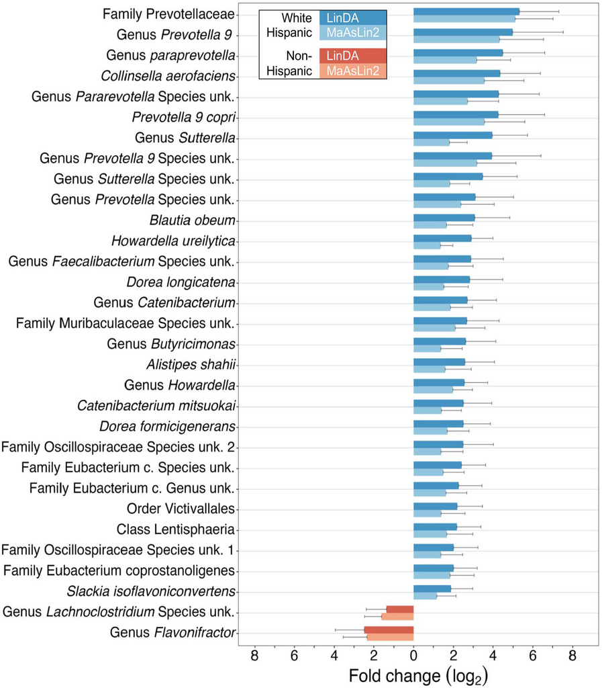
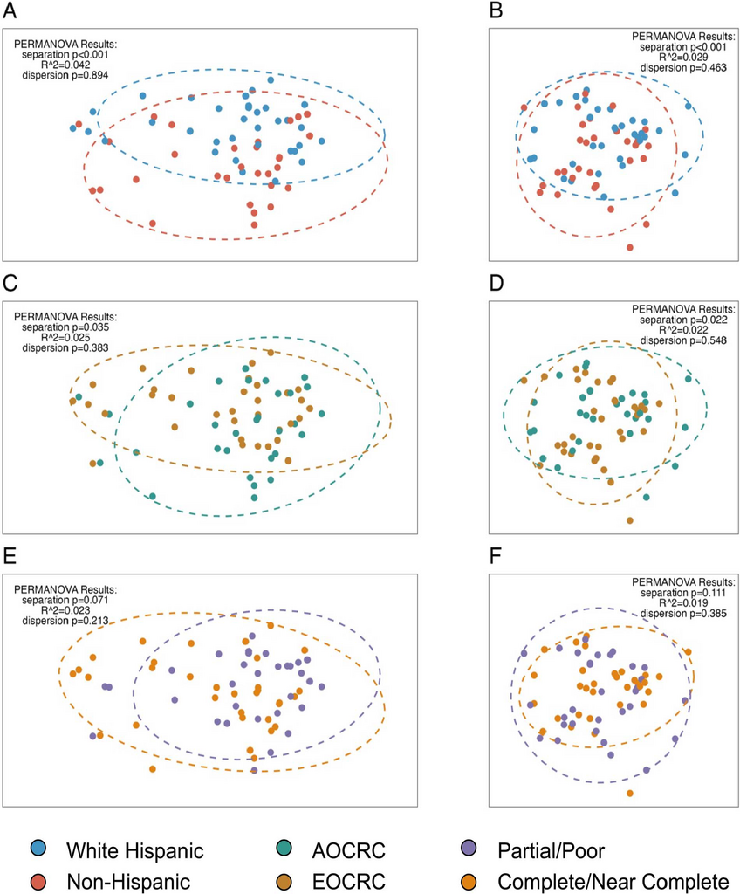

```{=html}
<style type="text/css">

code.r{
  font-size: 14px;
}
td {
  font-size: 12px;
}
pre {
  font-size: 12px;
}

</style>
```

## Overview

The gut microbiome varies across individuals in ways that aren't fully understood — shaped by diet, environment, genetics, and a lot of noise. This paper, published in the [*Journal of Immunotherapy and Precision Oncology*](https://doi.org/10.36401/JIPO-23-30) (2024), looks at whether rectal cancer patients show distinct microbiome signatures by ethnicity, age of onset, and treatment response — using a prospectively collected cohort where I personally collected every stool sample.

Prevotellaceae is a family of gut bacteria that shows up frequently in microbiome research, though its role in colorectal cancer is genuinely unclear. Some studies associate it with certain dietary patterns, others find it elevated in specific cancer cohorts — and with a cohort of 64 patients, we're not in a position to say much about why it's elevated here. What we can say is that the finding was consistent across two independent methods, which is the most we can claim given the sample size.

This raises the obvious confounder question: **Is the ethnicity association we found actually a diet association?** Our 16S sequencing captures *who's there* in the gut, not *why* they're there. Disentangling whether ethnicity is proxying for diet, host genetics, or some other environmental exposure isn't possible from this data. That's a real limitation, and it's worth being upfront about it.

### On Sample Size and the Noise Floor of Microbiome Studies

Sixty-four patients is small, and I won't pretend otherwise. I'll say this much: I collected every single one of those samples myself. I enrolled the patients onto the study, handed them the kits, collected the samples, and put them in the freezer. So I have a personal appreciation for why prospective microbiome cohorts are hard to grow.

The pre-treatment timing requirement is the main bottleneck. Antibiotics, bowel prep, and chemoradiation all dramatically disrupt the native microbiome, so samples have to come in before any of that starts — which means a very short window between diagnosis and first treatment. But even setting aside the logistical challenges, the microbiome itself is a noisy measurement. Diet fluctuates day to day. A patient who had a stomach bug last month, or took a course of antibiotics for a dental procedure, or just happened to eat differently the week of collection — all of that shows up in the 16S signal. There's a real noise floor to this kind of data that doesn't go away with better sequencing; it's just inherent to measuring a system that changes constantly in response to things that have nothing to do with cancer.

That's part of why the dual-method approach and the Cauchy combination of p-values mattered so much here. With a small sample and noisy measurements, requiring agreement across independent methods is one of the few levers you have for distinguishing real signal from lucky noise.

[Publication Link](https://doi.org/10.36401/JIPO-23-30)

## 16S rRNA Processing with DADA2

Raw paired-end FASTQ files from Illumina MiSeq sequencing were processed through the [DADA2](https://benjjneb.github.io/dada2/) pipeline to resolve amplicon sequence variants (ASVs) — the modern replacement for OTU clustering that retains single-nucleotide resolution.

The core pipeline: quality filtering, error model learning, denoising, read merging, chimera removal, and taxonomic assignment against the Silva v138.1 database:

``` r
# Quality-based filtering and trimming
out <- filterAndTrim(fnFs, filtFs, fnRs, filtRs,
                     truncLen = c(220, 200),   # trim forward/reverse
                     maxN = 0, maxEE = c(2, 2), truncQ = 2,
                     rm.phix = TRUE, compress = TRUE,
                     multithread = TRUE, trimLeft = 30)

# Learn error rates for the DADA2 algorithm
errF <- learnErrors(filtFs, multithread = TRUE)
errR <- learnErrors(filtRs, multithread = TRUE)

# Core denoising
dadaFs <- dada(filtFs, err = errF, multithread = TRUE)
dadaRs <- dada(filtRs, err = errR, multithread = TRUE)

# Merge paired reads and remove chimeras
mergers <- mergePairs(dadaFs, filtFs, dadaRs, filtRs, verbose = TRUE)
seqtab <- makeSequenceTable(mergers)
seqtab.nochim <- removeBimeraDenovo(seqtab, method = "consensus",
                                     multithread = TRUE)

# Taxonomic assignment with Silva
taxa <- assignTaxonomy(seqtab.nochim, "silva_nr99_v138.1_train_set.fa.gz",
                       multithread = TRUE)
taxa <- addSpecies(taxa, "silva_species_assignment_v138.1.fa.gz")
```

The `truncLen` parameters (220 for forward, 200 for reverse) were chosen by inspecting quality profiles — reverse reads typically degrade faster. The `trimLeft = 30` removes primer sequences.

## Phyloseq Object Construction

All downstream analyses used [phyloseq](https://joey711.github.io/phyloseq/) objects that bundle the ASV count matrix, taxonomy table, and clinical metadata. The construction function handles several data quality steps:

``` r
build_phylo_obj <- function(selected_patients, counts_all) {
  # Filter to selected patients, remove Archaea, drop zero-count ASVs
  counts_all <- counts_all %>%
    filter(Kingdom != "Archaea") %>%
    filter(rowSums(across(where(is.numeric))) != 0)

  # Combine identical ASVs by full taxonomic string
  counts_all_combinedASV <- counts_all %>%
    mutate(taxonomy = paste(Kingdom, Phylum, Class, Order,
                            Family, Genus, Species, sep = ";"))

  counts_all_combinedASV3 <- counts_all_combinedASV2 %>%
    ddply("taxonomy", numcolwise(sum))

  # Build phyloseq components
  otu <- otu_table(asvs, taxa_are_rows = TRUE)
  samples <- sample_data(clin)
  tax <- tax_table(tax)
  obj <- phyloseq(otu, samples, tax)

  # 10% prevalence filter for the filtered version
  obj_filt <- filter_taxa(obj, function(x) sum(x > 5) > nrow(clin) * 0.1, TRUE)

  return(list(unfilt = obj, filt = obj_filt))
}
```

We return both filtered and unfiltered versions. The unfiltered object is used for differential abundance testing (which applies its own prevalence filters), while the filtered version is used for diversity analyses where rare taxa add noise.

## Differential Abundance: Dual-Method with Cauchy Combination

Minimizing false positives was the main analytical challenge here. With counts spanning six taxonomic levels and a small cohort, the multiple testing burden is substantial — and there's a published benchmark paper showing that differential abundance methods in microbiome research give wildly different results depending on which one you pick. That's not a minor issue; it means your findings can be a function of your software choice as much as your biology.

The solution was to use **two independent methods** with different normalization strategies and different underlying models, and require agreement between them before reporting anything:

-   **LinDA**: A linear model on the centered log-ratio (CLR) transform — handles compositionality directly, supports mixed effects for batch
-   **MaAsLin2**: CSS normalization with a log transform and mixed-effects linear model — different normalization path to a similar goal

Both were run across all taxonomic levels (Phylum through Species) with 20% prevalence filtering and Benjamini-Hochberg FDR correction:

``` r
run_mas_all_levels <- function(phylo_obj, variable) {
  mas_results <- data.frame()
  tax_levels <- c("Phylum", "Class", "Order", "Family", "Genus", "Species")

  for (tax_level in tax_levels) {
    obj_sub <- aggregate_taxa(phylo_obj, tax_level)
    fit_mas <- Maaslin2(
      input_data = data.frame(obj_sub@otu_table),
      input_metadata = data.frame(obj_sub@sam_data),
      fixed_effects = c(variable),
      random_effects = c("batch"),
      min_prevalence = 0.2,
      normalization = "CSS",
      transform = "LOG")
    mas_results <- rbind(mas_results, data.frame(fit_mas$results))
  }

  mas_results$mas_bhcor_p <- p.adjust(mas_results[, 6], method = "BH")
  return(mas_results)
}
```

The LinDA wrapper follows the same pattern but uses a formula-based interface with mixed effects:

``` r
run_linda_all_levels <- function(phylo_obj, variable) {
  lin_results <- data.frame()
  tax_levels <- c("Phylum", "Class", "Order", "Family", "Genus", "Species")

  for (tax_level in tax_levels) {
    obj_sub <- aggregate_taxa(phylo_obj, tax_level)
    fit_lin <- linda(
      data.frame(obj_sub@otu_table),
      data.frame(obj_sub@sam_data),
      formula = paste0("~", variable, "+(1|batch)"),
      type = "count", prev.cut = 0.2,
      adaptive = TRUE, pseudo.cnt = 0.5)
    lin_results <- rbind(lin_results, data.frame(fit_lin$output))
  }

  lin_results$lin_bhcor_p <- p.adjust(lin_results[, 5], method = "BH")
  return(lin_results)
}
```

Results from both methods were combined using the **Cauchy combination test** — a method for merging p-values that is robust to dependence between tests:

``` r
# Cauchy combination of p-values from LinDA and MaAsLin2
combined_wp <- combined2 %>%
  mutate(couchy_t = 0.5 * ((tan((0.5 - pvalue_lin) * pi)) +
                            tan((0.5 - pvalue_mas) * pi))) %>%
  mutate(couchy_p = 0.5 - (atan(couchy_t) / pi))

# Final BH correction on combined p-values
combined_wp$comb_bhcor_p <- p.adjust(combined_wp$couchy_p, method = "BH")
```

We ran models for multiple comparisons — ethnicity, age of onset, treatment response, T-stage, and antibiotics — each adjusting for the others as appropriate.

{width=66%}

## Batch Correction with ConQuR

Stool samples were collected across five sequencing batches. For beta diversity analysis, we used the [ConQuR](https://github.com/wdl2459/ConQuR) package (quantile regression approach) to remove batch effects while preserving biological signal:

``` r
corrected_asv <- ConQuR_libsize(
  tax_tab = asv_t,
  batchid = batch_ids,
  covariates = covars2,       # facility, onset, response, ethnicity, antibiotics
  batch_ref = "2",
  logistic_lasso = TRUE,
  quantile_type = "lasso",
  interplt = TRUE,
  num_core = 4)
```

ConQuR explicitly models the batch effect using lasso-regularized quantile regression, adjusting the count table while preserving the covariate structure. We chose ConQuR over ComBat (the more commonly used batch correction tool) because ComBat was designed for continuous data like gene expression microarrays and assumes approximately normal distributions. Microbiome count data is sparse, zero-inflated, and compositional — properties that violate ComBat's assumptions. ConQuR was built specifically for microbiome count tables and handles the zero-inflation and overdispersion that characterize 16S data.

## Beta Diversity & PERMANOVA

Community-level composition was compared using two complementary distance metrics on the batch-corrected counts:

-   **Bray-Curtis dissimilarity** (on relative abundances) — captures differences in proportional composition
-   **Aitchison distance** (on CLR-transformed data) — addresses compositionality of microbiome data

``` r
# Compositional transform for Bray-Curtis
otus.rel <- microbiome::transform(phy_batch_corr, method = "compositional")
dist_bray <- vegdist(t(abundances(otus.rel)), method = "bray")

# CLR transform for Aitchison distance
otus.clr <- microbiome::transform(phy_batch_corr, method = "clr")
dist_atch <- vegdist(t(abundances(otus.clr)), method = "robust.aitchison")

# PCoA ordination
pcoa_bray <- ape::pcoa(dist_bray, correction = "cailliez")
pcoa_atch <- ape::pcoa(dist_atch)
```

Statistical testing used PERMANOVA (100,000 permutations) with a betadisper test to confirm that significant results reflected true centroid separation rather than differences in dispersion:

``` r
# Ethnicity — significant separation, no dispersion difference
vegan::adonis2(t(otus.clr2) ~ ethnicity, data = pat_d6_ordered,
               permutations = 100000, method = "robust.aitchison")
# p < 0.001, R^2 = 0.029

permutest(betadisper(dist_atch, pat_d6_ordered$ethnicity),
          permutations = 100000)
# dispersion p = 0.463 (not significant — confirms true separation)
```

Key PERMANOVA results:

| Comparison             | Bray-Curtis p | Aitchison p  | Dispersion p  |
|------------------------|---------------|--------------|---------------|
| Ethnicity              | **\< 0.001**  | **\< 0.001** | 0.463 / 0.894 |
| Onset (EOCRC vs AOCRC) | **0.035**     | **0.022**    | 0.383 / 0.548 |
| Treatment response     | 0.071         | 0.111        | 0.213 / 0.385 |

{width=75%}

## Alpha Diversity

Within-sample diversity was assessed using Chao1 (richness), Shannon (evenness-weighted), and Simpson (dominance) indices. The key finding: **Shannon diversity was significantly lower in early-onset patients** (p = 0.029), suggesting reduced microbial evenness in younger CRC patients.

``` r
alpha_meas <- c("Chao1", "Shannon", "Simpson")

p1 <- plot_richness(phy_obj$unfilt, "ethnicity", measures = alpha_meas)
p1b <- p1 +
  geom_boxplot(aes(x = ethnicity, y = value, color = ethnicity), alpha = 0.1) +
  stat_compare_means(method = "wilcox.test",
                     aes(label = ..p.format..),
                     label.x.npc = "center") +
  theme_test() +
  scale_color_manual(values = c("#d6604d", "#4393c3"))
```

No significant alpha diversity differences were found by ethnicity or treatment response.

## Key Takeaways

-   **Prevotellaceae enrichment in White Hispanic patients** (fold change \~5x, combined adjusted p = 0.0007) — consistent across two independent DA methods
-   **Ethnicity drives community-level separation** (PERMANOVA p \< 0.001) while treatment response does not
-   The **dual-method approach** (LinDA + MaAsLin2 with Cauchy combination) is a practical strategy for reducing false positives in microbiome studies
-   **Batch correction choice matters for microbiome data** — ConQuR handles zero-inflated count data better than methods designed for continuous data
-   **Shannon diversity is reduced in early-onset CRC** patients, warranting investigation into whether reduced microbial evenness contributes to early carcinogenesis

## What We'd Do Differently

This paper was an absolute slog. Prospective sample collection is slow, and the analytical challenge of small n + many dimensions (six taxonomic levels, multiple comparisons) meant doing a lot of work to be cautious about results that still can't be interpreted with much confidence. That's just the reality of a 64-patient microbiome study.

The biggest thing I'd change on the methods side is the sequencing approach. 16S rRNA sequencing tells you *who is present* at the genus or family level but doesn't give you quantitative abundance information with a reliable denominator. A PCR-based method with a known spike-in control — or shotgun metagenomics — would give much better ability to estimate actual abundances rather than relative proportions, which would make the compositional analysis more interpretable.

On the study design side, a single pre-treatment timepoint is the minimum viable snapshot. What would actually be interesting is longitudinal sampling — before treatment, partway through chemoradiation, after surgery — to track how the microbiome changes and whether those changes associate with treatment response. That's a harder study to run, but it's the question that would actually matter clinically. A dietary questionnaire would also add interpretive value, though with a cohort this size it wouldn't fully resolve the diet-vs-ancestry confounding question anyway.

## Citation

**Hein D**, Coughlin LA, Poulides N, Koh AY, Sanford NN. Assessment of distinct gut microbiome signatures in a diverse cohort of patients undergoing definitive treatment for rectal cancer. *Journal of Immunotherapy and Precision Oncology*. 7(3):150–158 (2024). <https://doi.org/10.36401/JIPO-23-30>