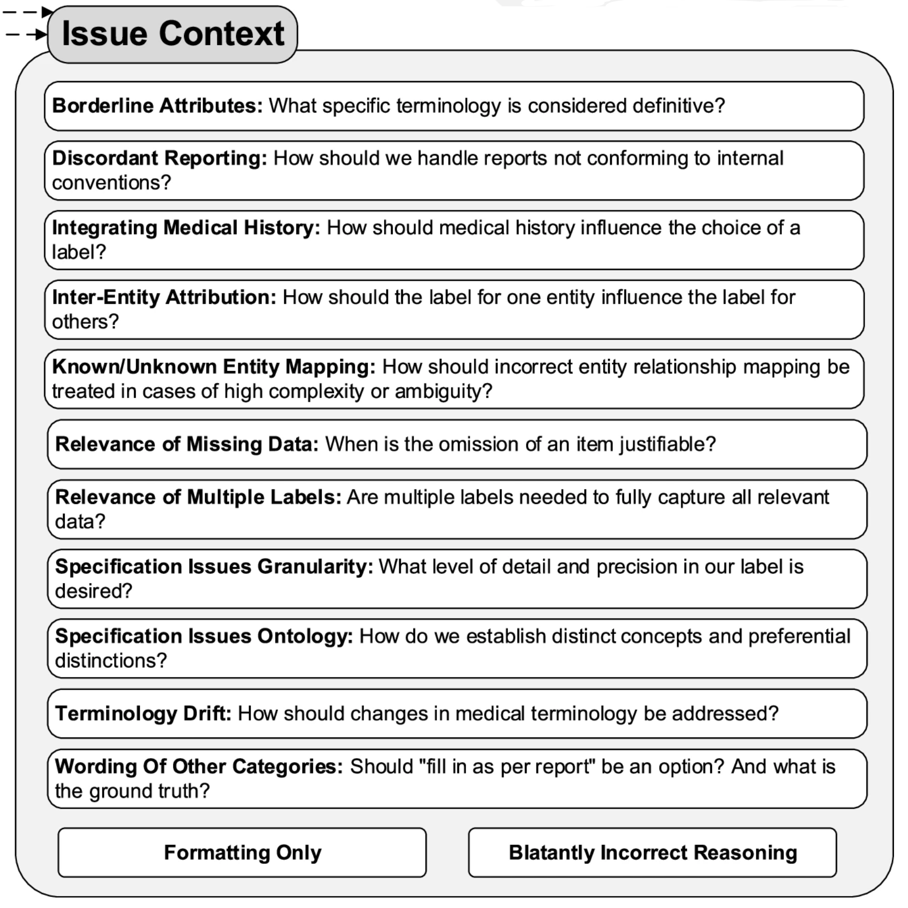

## The Problem That Started It All

The kidney cancer program at UT Southwestern had thousands of pathology reports and a research question that required structured data out of them — tumor subtype, specimen histology, detailed IHC panel results, procedure, anatomical site. The kind of information that lives in free-text narrative reports but doesn't exist in any database. The traditional solution is a trained human abstractor reading each report and manually entering data into a spreadsheet. That's slow, expensive, hard to scale, and introduces its own error rate.

This project started as a question: could an LLM do this reliably? After iterative development with a multidisciplinary team, the answer is yes — but not for the reasons you'd expect. The F1 scores and the framework choices aren't the interesting part. What turned out to matter most was something harder and less technical: *precisely defining what you actually want to extract, and why*.

That insight — that success increasingly hinges on the clarity of objective articulation rather than on workflow methodology — ended up being the intellectual core of the paper, published in [*npj Digital Medicine*](https://doi.org/10.1038/s41746-025-01686-z) (2025).

## A Brief Note (Opinion) on Metrics and Frameworks

Performance numbers got good — macro-averaged F1 of 0.99 on RCC subtype classification across 3,520 institutional reports, with reasonable portability to breast and prostate cancer datasets. But I'd caution against treating those numbers as the main takeaway for a few reasons.

First, F1 scores in this context are at best smoke tests and at worst actively misleading. They don't capture the clinical significance of errors. Misclassifying a result as "negative" versus "positive" is categorically different from a minor formatting discrepancy like "positive, diffusely" versus "diffuse positive" — but both show up identically in an exact-match calculation. The only way to understand whether a pipeline is actually working is to look at *what kind* of errors it makes and whether those errors matter clinically.

Second, the specific technical choices — the prompt framework, the orchestration tool, the LLM backbone — are already changing rapidly and were somewhat out of date by publication. What generalizes is the process, not the stack.

## The Error Ontology: What Actually Matters

The most useful thing we built wasn't the pipeline — it was a taxonomy for classifying every discrepancy between LLM output and our gold-standard annotations. Every mismatch got categorized by source (LLM error, annotation error, or schema gap), severity (major vs. minor, where major means clinically significant), and context. That last dimension — context — is where things got interesting.

The error ontology revealed four recurring categories of failure, each requiring a different kind of fix. The figure below shows the 13 more granular error subcategories we tracked — the four broader groupings discussed here each draw from several of these.

{width="66%"}

### 1. Report Complexity

Some reports were just structurally difficult in ways that no amount of prompt engineering fully resolved. Outside consultation reports were the worst offenders. These often contained a mix of IHC tests where specimen identity was clearly documented for some tests but left ambiguous for others. Outside consultations also used different specimen naming conventions: what the outside institution labeled "Specimen B" might be referred to internally as "Specimen A," and the model had to reconcile these without any explicit mapping.

### 2. Specification Issues

The most intellectually interesting category was what we called specification issues — cases where the LLM's output was wrong not because the model failed, but because *we hadn't clearly defined what we wanted*.

A lot of the refinement process was essentially the team arguing about what the "right" answer should be, in ways we hadn't anticipated before starting. How granular should anatomical site be? When a specimen originates from a nephrectomy but is referred to as a "resection" in the report text, which label is correct? When both "Positive" and "Intact" are reported for BAP-1, which should take precedence?

These aren't LLM problems. They're task definition problems that would have existed regardless of the extraction method. The LLM just made them visible faster and more systematically than manual abstraction would have, because it applied whatever rules we gave it consistently — which meant inconsistencies in our rules became immediately apparent in the output.

### 3. Normalization Difficulties

Normalizing free-text entries to controlled vocabulary was persistently tricky. "Other-\<as per report\>" categories were necessary to avoid information loss, but they consistently generated minor discrepancies because verbatim matching between LLM output and gold-standard is hard to achieve reliably.

One specific example was kind of interesting: normalizing "diffusely" to "diffuse" accounted for over half of the remaining formatting discrepancies in the final iteration (15 out of 28 errors), despite "diffuse" being a relatively infrequent term overall. Investigating why, we looked at the GPT-4o tokenizer's byte pair encoding behavior and found that "diffusely" was tokenized differently depending on the preceding character — splitting into three tokens after a newline but two after a space. We hypothesize this differential sub-word tokenization contributed to the inconsistent normalization. That's a detail most pipelines would never surface, and it's exactly the kind of thing the error ontology forced us to look at.

On the positive side, the pipeline proved surprisingly good at normalizing historical terminology to updated terms — something rule-based systems struggle with.

### 4. Medical Nuance and "Malicious Compliance"

The final category required direct clinical input from the pathology team, and produced some of the most interesting failure modes.

One example: the phrase "consistent with" carries more conclusive clinical meaning in pathology reporting than in general language. A pathologist writing "consistent with clear cell RCC" is making a diagnostic statement; in general English, "consistent with" implies uncertainty. The LLM, trained on general text, was interpreting it the general way. Correcting this required the pathologist on the team to explain the domain convention, which then got embedded in the prompt instructions.

The more memorable failure was what we started calling **malicious compliance**. We added an instruction: "focus on the current specimen, not past medical history." Reasonable enough. But the LLM followed it too literally — discarding information that appeared in the history section of the report even when that history was directly relevant to the current interpretation. The model wasn't wrong; it was doing exactly what we said. The problem was that our instruction was underspecified. Fixing it required thinking carefully about what we actually meant, not just adding another rule.

These experiences shifted how we thought about the whole process. The LLM, by following instructions with strict consistency, became a kind of mirror for the quality of our own specifications. Ambiguities in the instructions showed up as errors in the output.

## The Collaborative Process

Getting this right required a genuinely multidisciplinary team — people with expertise in NLP and LLMs, downstream statistical analysis, and clinical pathology — all in regular conversation about what the discrepancies meant. The pathologist on the team was essential not just for validating outputs but for explaining the clinical context that made certain distinctions matter.

There was also an unexpected collaborator: the LLM itself. The chain-of-thought reasoning output, when the model explained its decisions, frequently surfaced why an instruction was being interpreted in an unintended way. Reading the model's reasoning was often more useful than just looking at whether the final answer was right or wrong.

The broader point here is one the paper makes explicitly: as LLMs approach human-level performance on many tasks, the bottleneck shifts from *how do I build a system that can do this* to *what exactly do I want the system to do*. Task specification becomes the hard problem.

## The Gold Standard Isn't Static

One conceptual shift that came out of this project: the gold-standard annotation set shouldn't be thought of as fixed ground truth. We revised our annotations multiple times as our understanding of the task evolved — not because the original annotations were wrong, but because the task itself got refined through the process of building the extractor.

This has implications for how you interpret performance numbers. An F1 score computed against a gold standard that was co-developed with the pipeline is measuring something different from one computed against a truly independent annotation. That's not a failure of the methodology — it's an honest reflection of how complex information extraction actually works. The "right answer" for some entities is genuinely context-dependent and will vary across research groups with different downstream needs.

## Why "Socratic Seminar"

A Socratic seminar works not because the facilitator has all the answers, but because the right questions force participants to surface and examine assumptions they didn't know they were making.

The model's errors weren't just bugs to fix — they were questions. *What do you actually mean by anatomical site? How certain does the pathologist have to be before you'd call it a diagnosis? When you said "focus on the current specimen," what did you really mean?* Each discrepancy in the error ontology prompted a version of this. And frequently, the answer required the team to have a substantive conversation they hadn't thought to have before the pipeline forced it.

The "malicious compliance" failure is the most Socratic moment in the whole project: the model did exactly what we said, and by doing so, showed us that we hadn't said what we meant.

What surprised me most was how much the process improved *our* understanding of the task, independently of the model's performance. By the end, we had a clearer shared definition of what we were extracting and why than we would have developed through any amount of upfront planning. The seminar worked.

## Open-Source Code

The pipeline is available as an open-source repo w/ a docs site: [**prompts_to_table**](https://davidhein96.github.io/prompts_to_table/). The technical implementation details are there if you need them — prompt templates, output validation, orchestration. The harder part, documented in the paper, is the process that got the prompts to where they ended up.

## Citation

**Hein D**, Christie A, Holcomb M, Xie B, Jain AJ, Vento J, Rakheja N, Shakur AH, Christley S, Cowell LG, Brugarolas J, Jamieson AR, Kapur P. Iterative refinement and goal articulation to optimize large language models for clinical information extraction. *npj Digital Medicine*. 8, 301 (2025). <https://doi.org/10.1038/s41746-025-01686-z>