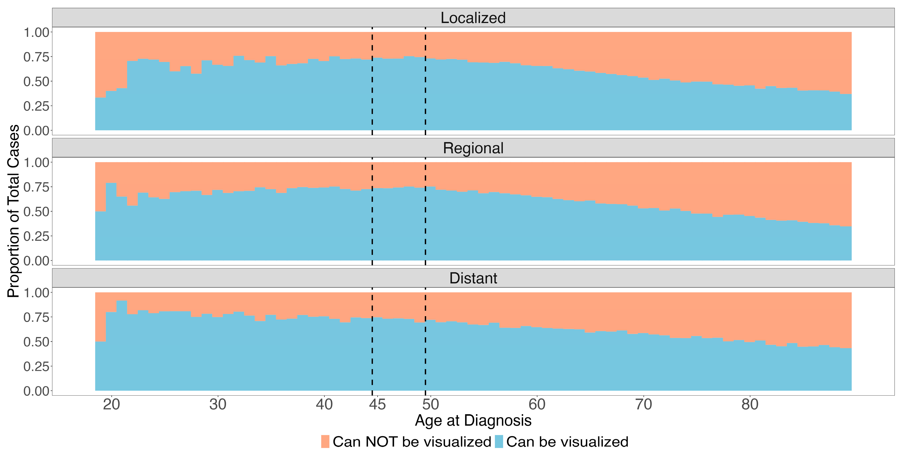
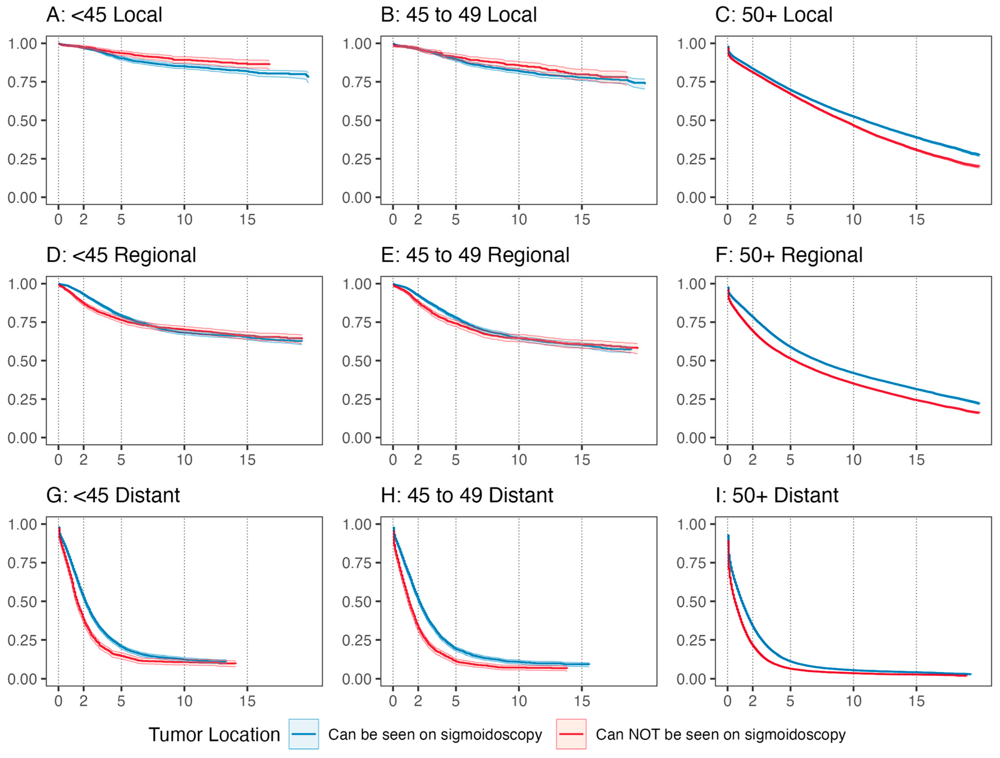

```{=html}
<style type="text/css">

code.r{
  font-size: 14px;
}
td {
  font-size: 12px;
}
pre {
  font-size: 12px;
}

</style>
```

## 73% of Young Adult Colorectal Cancers Are Reachable Without a Full Colonoscopy

Colorectal cancer screening guidelines were updated in 2021 when the USPSTF lowered the recommended screening age from 50 to 45. The default recommendation is colonoscopy — it visualizes the entire colon and can remove precancerous lesions in the same procedure. But colonoscopy requires extensive bowel prep, is performed under sedation, and carries small but real risks of serious adverse events including perforation and severe bleeding. For younger adults who feel healthy and have no symptoms, these are genuine barriers.

The debate got more complicated in October 2022 with the NordICC trial — a randomized study of 80,000 patients that found no significant reduction in CRC mortality with *invitation* to colonoscopy screening in the intention-to-treat analysis. The key word is invitation: only 42% of patients randomized to colonoscopy actually completed the exam. Proponents of colonoscopy point to the per-protocol analysis (which did show a benefit) and argue that higher completion rates in routine US practice could produce different results. But population-level US data show colonoscopy adherence of 50–60%, and the largest randomized trial of flexible sigmoidoscopy achieved a 63% completion rate — ranging up to 83% across RCTs.

This is the policy context for our [paper in *Cancers*](https://doi.org/10.3390/cancers16061110) (2024). Flexible sigmoidoscopy is limited to the rectum, sigmoid colon, and descending colon — it misses proximal tumors. The question is how much that tradeoff actually costs in a younger patient population, where the rise in early-onset CRC has been largely driven by rectal and sigmoid tumors. Using **309,466 patients** from the SEER database, we found that **73% of CRC in patients under 50 arises in sigmoidoscopy-reachable locations** — and those tumors have comparable or better survival outcomes after adjusting for confounders.

The conclusion isn't that sigmoidoscopy should replace colonoscopy. It's that a "colonoscopy-first" public health message aimed at newly eligible 45-year-olds may be counterproductive if it discourages people from getting screened at all — and that the data support considering sigmoidoscopy as a pragmatic alternative for younger patients.

## Data & Cohort Definition

The raw SEER extract contains dozens of variables. After selecting relevant columns, the key filtering and feature engineering steps are:

``` r
# Keep only adenocarcinoma (histologic code 8140)
new_data <- new_data %>%
  filter(`Histologic Type ICD-O-3` == 8140)

# Exclude appendix and unknown-location tumors
new_data <- new_data %>%
  filter(!`Primary Site` %in% c(260, 188, 189, 181))

# Binary indicator: can the tumor be seen on sigmoidoscopy?
# Includes descending colon (186), sigmoid (187), rectosigmoid junction (199), rectum (209)
new_data <- new_data %>%
  mutate(can_see_sigmoid = ifelse(`Primary Site` %in% c(186, 187, 199, 209), 1, 0))

# Three age groups aligned with screening guideline thresholds
new_data <- new_data %>%
  mutate(age_numeric = as.numeric(str_extract(
    `Age recode with single ages and 90+`, "[:digit:]+"))) %>%
  mutate(age_group_final = case_when(
    age_numeric < 44 ~ "under45",
    age_numeric < 53 ~ "45-50",
    TRUE ~ "over50"))
```

The cancer-specific survival endpoint required combining several SEER variables, censoring patients who died of other causes:

``` r
new_data3 <- new_data2 %>%
  mutate(cancer_specific_status = case_when(
    `COD to site recode ICD-O-3 2023 Revision` == "Alive" ~ 0,
    `SEER cause-specific death classification` == "Dead (attributable to this cancer dx)" ~ 1,
    `SEER other cause of death classification` ==
      "Dead (attributable to causes other than this cancer dx)" ~ 2,
    `SEER cause-specific death classification` == "Dead (missing/unknown COD)" ~ 2))
```

## Proportion of Sigmoid-Visible Tumors by Age

The stacked bar chart is the most intuitive visualization in the paper — it shows the proportion of tumors that would vs. would not be caught by sigmoidoscopy, broken out by age and stage:

``` r
sum_data <- new_data5 %>%
  group_by(age_numeric, new_stage) %>%
  summarize(sigcan = sum(can_see_sigmoid) / n())

sum_data$nocan <- 1 - sum_data$sigcan

sum_data <- pivot_longer(sum_data, cols = c(sigcan, nocan),
                         names_to = "proptype", values_to = "proportion")

ggplot(sum_data, aes(x = age_numeric, y = proportion, fill = proptype)) +
  geom_bar(stat = "identity", position = "fill", width = 1.1) +
  facet_wrap(~ new_stage, ncol = 1) +
  theme_test() +
  labs(fill = "Visualization on Sigmoidoscopy") +
  scale_fill_manual(
    labels = c("Can NOT be visualized", "Can be visualized"),
    values = c("#f4a582", "#92c5de")) +
  ylab("Proportion of Total Cases") + xlab("Age at diagnosis") +
  scale_x_continuous(limits = c(18, 90), breaks = c(20, 30, 40, 45, 50, 60, 70, 80)) +
  geom_vline(aes(xintercept = 44.5), color = "black", linetype = "dashed", size = 0.4) +
  geom_vline(aes(xintercept = 49.5), color = "black", linetype = "dashed", size = 0.4)
```

The dashed vertical lines mark the 45 and 50 age thresholds — key ages in current screening guidelines. The takeaway: younger patients have a substantially higher proportion of distal (sigmoid-visible) tumors.



## Logistic Regression for Tumor Location

We used logistic regression to model the odds of a tumor being in a sigmoidoscopy-visible location. First univariate models for each covariate, then a full multivariate model:

``` r
# Univariate models
age_log <- tidy(glm(can_see_sigmoid ~ age_group_final, data = new_data5,
                     family = "binomial"), conf.int = TRUE) %>%
  mutate(estimate = exp(estimate), conf.low = exp(conf.low), conf.high = exp(conf.high))

race_log <- tidy(glm(can_see_sigmoid ~ race_eth, data = new_data5,
                      family = "binomial"), conf.int = TRUE) %>%
  mutate(estimate = exp(estimate), conf.low = exp(conf.low), conf.high = exp(conf.high))

# Multivariate model
multi_log <- tidy(glm(can_see_sigmoid ~ race_eth + Sex + age_group_final +
                       new_stage + year_of_diag,
                       data = new_data5, family = "binomial"), conf.int = TRUE) %>%
  mutate(estimate = exp(estimate), conf.low = exp(conf.low), conf.high = exp(conf.high))
```

Key findings: male sex (OR 1.54) and Asian/Pacific Islander race (OR 1.60) were associated with higher odds of sigmoid-visible tumors, while Non-Hispanic Black patients had lower odds (OR 0.76).

## IPTW-Adjusted Survival Curves

This is where the analysis gets interesting. The naive comparison of survival by tumor location (sigmoid-visible vs. not) is confounded by demographic differences between groups. We addressed this using **inverse probability of treatment weighting (IPTW)**.

The propensity model estimates the probability of having a sigmoid-visible tumor based on sex, race, and ethnicity — the variables most strongly associated with tumor subsite in our logistic regression. The `adjustedCurves` package uses these weights to produce adjusted Kaplan-Meier curves:

``` r
get_adjusted_surv <- function(age_group, stage, osdata) {

  os_surv_data <- osdata %>%
    filter(age_group_final == age_group, new_stage == stage) %>%
    select(can_see_sigmoid, survival_months, overall_status, race_eth, Sex) %>%
    mutate(can_see_sigmoid2 = as.factor(
      ifelse(can_see_sigmoid == 0, "not_see", "can_see")))

  # Propensity score model: P(sigmoid-visible | race, sex)
  propensity_log <- glm(can_see_sigmoid ~ race_eth + Sex,
                        data = os_surv_data, family = "binomial")

  # IPTW-adjusted Kaplan-Meier with bootstrap CIs
  surv_adjusted <- adjustedsurv(
    os_surv_data,
    variable = "can_see_sigmoid2",
    ev_time = "survival_months",
    event = "overall_status",
    method = "iptw_km",
    treatment_model = propensity_log,
    conf_int = TRUE,
    bootstrap = TRUE,
    n_boot = 2000,
    conf_level = 0.95,
    n_cores = 4)

  return(surv_adjusted)
}
```

We computed adjusted curves for all 9 combinations of age group (under 45, 45–49, 50+) and stage (localized, regional, distant):

``` r
set.seed(2023)
surv_local_young <- get_adjusted_surv("under45", "Localized", new_data6)
surv_local_mid   <- get_adjusted_surv("45-50",   "Localized", new_data6)
surv_local_old   <- get_adjusted_surv("over50",  "Localized", new_data6)
surv_reg_young   <- get_adjusted_surv("under45", "Regional",  new_data6)
surv_reg_mid     <- get_adjusted_surv("45-50",   "Regional",  new_data6)
surv_reg_old     <- get_adjusted_surv("over50",  "Regional",  new_data6)
surv_dist_young  <- get_adjusted_surv("under45", "Distant",   new_data6)
surv_dist_mid    <- get_adjusted_surv("45-50",   "Distant",   new_data6)
surv_dist_old    <- get_adjusted_surv("over50",  "Distant",   new_data6)
```

## Adjusted RMST

I chose RMST for two reasons. First, the proportional hazards assumption was formally violated — the KM curves crossed, making a standard Cox hazard ratio inappropriate. You can see the crossing clearly in the adjusted survival curves below.

 But second, and more importantly, RMST is just more interpretable. A hazard ratio is a ratio of instantaneous event rates averaged over the follow-up period — clinically, that's hard to explain to anyone. RMST gives you the average number of months survived up to a specified time horizon, which is something you can actually put in a sentence: "patients with sigmoid-visible tumors survived an average of X months longer over 10 years." That directness was appealing, and the violated PH assumption made it the right call methodologically too.

We calculated RMST at 2, 5, and 10 years for each age–stage subgroup, with Bonferroni correction for the 27 comparisons:

``` r
get_rmst <- function(adj_surv, age_group, stage, months) {

  # Bonferroni correction for 27 tests
  alpha_corrected <- 1 - (0.05 / 27)

  rmst_results <- adjusted_rmst(
    adj_surv,
    to = months,
    difference = FALSE,
    conf_int = TRUE,
    group_1 = "not_see",
    group_2 = "can_see",
    conf_level = alpha_corrected)

  rmst_tidy <- rmst_results %>%
    as.data.frame() %>%
    mutate(age_group = age_group, stage = stage, time_p = months)

  return(rmst_tidy)
}
```

The results were then computed across all 9 survival curves at 3 time horizons (24, 60, and 120 months):

``` r
stages <- c("Localized", "Regional", "Distant")
ages   <- c("under45", "45-50", "over50")
survs  <- list(surv_local_young, surv_local_mid, surv_local_old,
               surv_reg_young, surv_reg_mid, surv_reg_old,
               surv_dist_young, surv_dist_mid, surv_dist_old)

all_rmsts <- data.frame()
i <- 0

for (surv in survs) {
  for (m in c(24, 60, 120)) {
    all_rmsts <- rbind(all_rmsts,
                       get_rmst(surv, ages[1 + i %% 3],
                               stages[ceiling((i + 1) / 3)], m))
  }
  i <- i + 1
}
```

## RMST Forest Plot

The final figure is a point-range (forest) plot showing the RMST estimates with 99.8% CIs (Bonferroni-adjusted) for each subgroup, colored by tumor location and follow-up time:

``` r
ggplot(data = all_rmst3, aes(y = rmst, x = stage, color = color_var,
                             ymin = rmst - 2.58 * se, ymax = rmst + 2.58 * se,
                             group = group)) +
  geom_pointrange(position = position_dodge(width = 0.5)) +
  facet_wrap(~group2, ncol = 1) +
  scale_color_manual(
    labels = c("Requires Colonoscopy: 10 years", "Requires Colonoscopy: 5 years",
               "Requires Colonoscopy: 2 years",
               "Sigmoidoscopy: 10 years", "Sigmoidoscopy: 5 years",
               "Sigmoidoscopy: 2 years"),
    values = c("#b2182b", "#d6604d", "#f4a582", "#2166ac", "#4393c3", "#92c5de"),
    name = "Tumor location \nand RMST follow up time") +
  coord_flip() +
  scale_y_continuous(limits = c(0, 122), breaks = c(0, 24, 60, 120),
                     labels = c("0", "2", "5", "10")) +
  theme_bw() +
  theme(panel.grid.minor = element_blank(),
        panel.grid.major.x = element_line(linetype = 2)) +
  ylab("Years of Follow Up") + xlab("")
```

{width="75%"}

For localized disease, survival was comparable regardless of tumor location across all age groups. For regional and distant disease, sigmoid-visible tumors showed improved RMST — meaning that the cancers sigmoidoscopy *can* detect not only represent the majority of cases in younger patients, but also tend to have equivalent or better survival outcomes.

## The Policy Argument

The paper is careful not to claim sigmoidoscopy is superior to colonoscopy — colonoscopy can detect proximal tumors and remove precancerous lesions in one procedure, and for high-risk individuals it's the right choice. The argument is narrower: for newly eligible, average-risk patients aged 45–49 who are hesitant about colonoscopy, the "colonoscopy or nothing" framing may be doing more harm than good.

A few things make the case:

-   **73% of CRC in patients under 50** arises in sigmoidoscopy-reachable locations — the additional coverage from full colonoscopy doesn't translate to 66% of tumors
-   **Screening completion** for sigmoidoscopy was 63–83% in RCTs vs. 42% in NordICC and 50–60% in US population data for colonoscopy
-   **Survival for sigmoid-visible tumors** is comparable or better than for proximal tumors after IPTW adjustment — the tumors sigmoidoscopy catches aren't the "easy" ones
-   The rise in early-onset CRC has been **driven largely by rectal and sigmoid cancers** — exactly the locations sigmoidoscopy reaches

There's also a disparity angle: studies have shown that racial and ethnic minorities have greater acceptance of less invasive screening options, and a public health message that pushes colonoscopy as the only legitimate choice could widen existing gaps in screening uptake.

The conclusion in the paper is measured: these findings "call into question the advantages and disadvantages of a colonoscopy-first public health recommendation" and support "considering flexible sigmoidoscopy as an additional initial option." That's the right framing — not replacing colonoscopy, but expanding the menu for a population that currently isn't getting screened at all.

## Citation

Lin G, **Hein D**, Liu PH, Singal AG, Sanford NN. Screening Implications for Distribution of Colorectal Cancer Subsite by Age and Role of Flexible Sigmoidoscopy. *Cancers*. 2024; 16(6):1110. <https://doi.org/10.3390/cancers16061110>